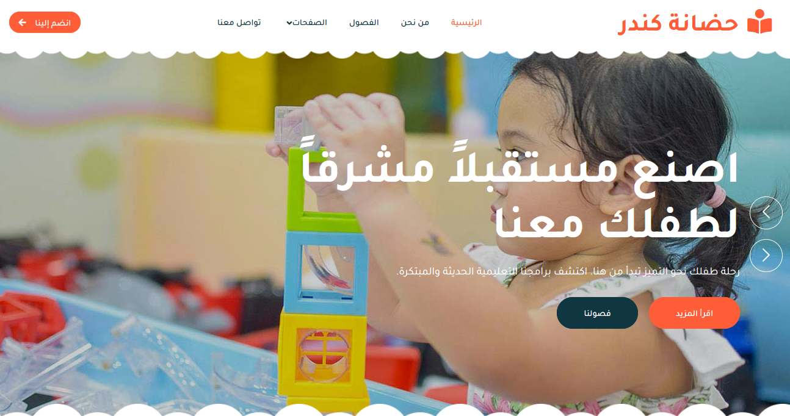

# 🎨 Kinder: Interactive Kindergarten Platform

[](https://reactjs.org/)
[](https://www.djangoproject.com/)
[](https://www.postgresql.org/)
[](https://opensource.org/licenses/MIT)

A full-stack **Kindergarten Management & Enrollment Platform** designed to bridge the gap between parents and educators. Featuring a dynamic frontend, secure online enrollment, and a robust administrative backend.

---

## 📸 Project Preview



> **Live Demo:** [link](https://moh-alfarjani.github.io/kinder-kindergarten/)  
> **Developer:** Mohammad Alfarjani

---

## 🚀 Project Overview

**Kinder** is a modern web application that provides a complete digital ecosystem for kindergartens. It streamlines the enrollment process and offers a transparent view of the curriculum and faculty.

### User Roles:
* **Parents / Guardians:** Explore classes, meet teachers via detailed profiles, view schedules, and submit secure enrollment forms.
* **Admins / Educators:** Full control over site content, student data, and enrollment approvals via a centralized dashboard.

---

## 🛠️ Tech Stack

### **Frontend**
* **React.js** (Functional Components & Hooks)
* **React Router DOM** (Client-side Routing)
* **Axios** (API Interactivity)
* **Bootstrap / CSS3** (Responsive UI)

### **Backend**
* **Django** (Python Web Framework)
* **Django REST Framework** (API Architecture)
* **PostgreSQL / SQLite** (Relational Database)

---

## ✨ Key Features

### 🔐 Secure Enrollment System

* Real-time form validation.
* Secure data persistence with protection against duplicate entries.
* Instant notification/status tracking for admins.

### 👩‍🏫 Faculty & Curriculum Management
* **Teacher Profiles:** Showcasing qualifications, experience, and bios.
* **Class Programs:** Detailed overview of subjects, timings, and age groups.

### 🖼️ Interactive Gallery & Social Proof
* Dynamic gallery component for school activities.
* Moderated testimonials section to build trust with new parents.

### 💻 Advanced Admin Dashboard
* Full CRUD (Create, Read, Update, Delete) capabilities.
* Audit logs and student management system.
* Contact message management.

---

## 📅 Development Lifecycle

| Phase | Focus | Key Deliverable |
|:---:|:---|:---|
| **1** | **Architecture** | React SPA setup & Django API scaffolding |
| **2** | **Core Logic** | Secure Enrollment forms & Database Schema |
| **3** | **Content** | Teacher & Class Management modules |
| **4** | **UX/UI** | Responsive design, Animations, & Gallery |
| **5** | **Deployment** | Dockerization & Environment configuration |

---

## 🗂️ Project Structure

```text
Kinder/
├── frontend/                # React.js application
│   ├── src/
│   │   ├── components/      # Reusable UI (Classes, Teachers, Form)
│   │   ├── pages/           # Main Views
│   │   ├── services/        # Axios API configurations
│   │   └── App.js           # Routing Logic
├── backend/                 # Django Project
│   ├── kinder_app/          # Main application logic & Models
│   ├── settings.py          # Configuration
│   └── manage.py            # CLI Tool
├── static/                  # Media & Image assets
└── README.md                # Project documentation
```

---

## Installation & Setup
1. Clone the Repository
```text
Bash
git clone [https://github.com/yourusername/kinder-platform.git](https://github.com/yourusername/kinder-platform.git)
cd kinder-platform
```

2. Backend Setup
```text
Bash
cd backend
python -m venv venv
source venv/bin/activate  # On Windows: venv\Scripts\activate
pip install -r requirements.txt
python manage.py migrate
python manage.py createsuperuser
python manage.py runserver
```

3. Frontend Setup
```text
Bash
cd ../frontend
npm install
npm start
```

---

🌐 Contact
Mohammad Alfarjani: +218917252062

---

Role: Full-Stack Developer

---

💬 Final Note
Kinder demonstrates the power of combining a flexible React frontend with the "batteries-included" philosophy of Django to create a safe, scalable, and engaging educational platform.
